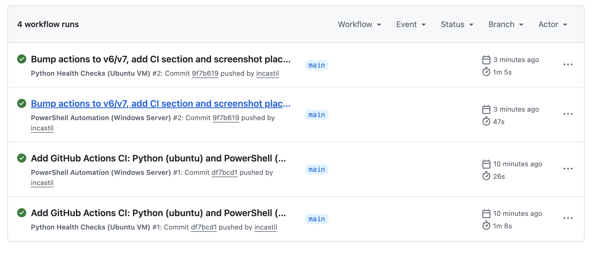

# Virtualized Infrastructure Monitoring & Automation Lab

[](https://github.com/incastil/Virtualized_Infrastructure/actions/workflows/python-health-checks.yml)
[](https://github.com/incastil/Virtualized_Infrastructure/actions/workflows/powershell-automation.yml)

A portfolio project demonstrating DevOps/SRE skills: virtualization, Windows Server administration, PowerShell automation, Python monitoring, and cross-platform server operations.

---

## Overview

This lab simulates a production-like multi-server environment using two virtual machines running on a host machine. The project delivers automation scripts for system inventory, service monitoring, backup management, server health checks, network diagnostics, and continuous resource monitoring.

**Skills demonstrated:**
- Virtualization (VirtualBox)
- Windows Server 2022 administration
- Linux (Ubuntu Server) administration
- PowerShell scripting and automation
- Python scripting and monitoring tooling
- Networking fundamentals and diagnostics
- Monitoring, alerting, and reporting
- Backup workflows and retention policies
- Cross-platform server operations

---

## Architecture

```
┌─────────────────────────────────────────────────────┐
│                    HOST MACHINE                     │
├─────────────────────────┬───────────────────────────┤
│  VM 1                   │  VM 2                     │
│  Windows Server 2022    │  Ubuntu Server 22.04      │
│  192.168.56.10          │  192.168.56.20            │
│                         │                           │
│  Ports:                 │  Ports:                   │
│  • RDP    3389          │  • SSH    22              │
│  • WinRM  5985          │  • HTTP   80              │
│  • SSH    22            │                           │
├─────────────────────────┴───────────────────────────┤
│  Network : Host-Only Adapter (vboxnet0)             │
│  Subnet  : 192.168.56.0/24                          │
│  Gateway : 192.168.56.1                             │
└─────────────────────────────────────────────────────┘
Virtualization Platform: VirtualBox or VMware Workstation Player
```

---

## Setup Instructions

### Prerequisites

- VirtualBox (https://www.virtualbox.org/) or VMware Workstation Player
- Windows Server 2022 Evaluation ISO (free 180-day trial from Microsoft)
- Ubuntu Server 22.04 LTS ISO (free from ubuntu.com)
- Host machine: 16 GB RAM recommended (8 GB minimum), 100 GB free disk

### 1. Install VirtualBox

Download and install VirtualBox for your OS. Install the Extension Pack for USB and remote display support.

### 2. Create VM 1 — Windows Server 2022

```
Name:         WinServer2022
Type:         Microsoft Windows
Version:      Windows 2022 (64-bit)
RAM:          4096 MB
Disk:         60 GB (dynamically allocated VDI)
Network:      Adapter 1: NAT (internet access)
              Adapter 2: Host-Only (192.168.56.10)
```

**Post-install steps:**
1. Set static IP on Host-Only adapter: `192.168.56.10 / 255.255.255.0`
2. Enable WinRM: `winrm quickconfig -force`
3. Enable SSH (optional): Install OpenSSH Server via Server Manager
4. Rename computer: `Rename-Computer -NewName "WINSERVER01" -Restart`
5. Enable Remote Desktop in System Settings

### 3. Create VM 2 — Ubuntu Server

```
Name:         UbuntuServer
Type:         Linux
Version:      Ubuntu (64-bit)
RAM:          2048 MB
Disk:         40 GB (dynamically allocated VDI)
Network:      Adapter 1: NAT (internet access)
              Adapter 2: Host-Only (192.168.56.20)
```

**Post-install steps:**
```bash
# Set static IP (Netplan)
sudo nano /etc/netplan/01-netcfg.yaml
# Add enp0s8 with address 192.168.56.20/24

# Install required packages
sudo apt update && sudo apt install -y python3 python3-pip openssh-server

# Install Python dependencies
pip3 install psutil
```

### 4. Configure Host-Only Network in VirtualBox

1. Open VirtualBox → File → Host Network Manager
2. Create/configure `vboxnet0`: `192.168.56.1/24`
3. Enable DHCP server or use static IPs as defined above

### 5. Verify Connectivity

From host machine:
```bash
ping 192.168.56.10   # Windows Server
ping 192.168.56.20   # Ubuntu Server
```

---

## PowerShell Automation

All PowerShell scripts live in `scripts/powershell/`. Run from PowerShell 5.1+ on Windows Server 2022 or host.

### Collect-SystemInfo.ps1

Collects comprehensive system inventory: OS details, CPU, RAM, disk, network config, and installed software.

```powershell
# Local machine
.\Collect-SystemInfo.ps1

# Remote host with CSV export
.\Collect-SystemInfo.ps1 -ComputerName "WINSERVER01" -ExportCSV -OutputPath "C:\Reports"

# Multiple hosts
.\Collect-SystemInfo.ps1 -ComputerName "WINSERVER01","192.168.56.10" -ExportCSV
```

**Output:** Console table + timestamped CSV in `OutputPath`.

---

### ServiceStatusReport.ps1

Monitors Windows services, flags stopped critical services, generates HTML and CSV reports, and optionally auto-restarts stopped services.

```powershell
# Basic scan (local)
.\ServiceStatusReport.ps1

# Remote scan with HTML/CSV report
.\ServiceStatusReport.ps1 -ComputerName "WINSERVER01" -ExportReport -OutputPath "C:\Reports"

# Auto-restart stopped critical services
.\ServiceStatusReport.ps1 -AutoRestart -ExportReport

# Custom critical service list
.\ServiceStatusReport.ps1 -CriticalServices "Spooler","WinRM","W32Time" -ExportReport
```

**Default critical services monitored:** Spooler, wuauserv, WinRM, EventLog, LanmanServer, LanmanWorkstation, W32Time, Dnscache, BITS, Schedule, SamSs

**Output:** Console summary + `ServiceReport_<timestamp>.csv` + `ServiceReport_<timestamp>.html`

---

### BackupAutomation.ps1

Automates directory backups with robocopy (folder copy) or ZIP compression. Supports configurable retention policies and writes an audit log.

```powershell
# Basic backup (folder copy)
.\BackupAutomation.ps1 -SourcePaths "C:\Data","C:\Configs" -BackupRoot "D:\Backups"

# Compressed ZIP backup, 14-day retention
.\BackupAutomation.ps1 -SourcePaths "C:\Data" -BackupRoot "D:\Backups" -CompressBackup -RetentionDays 14

# Schedule with Task Scheduler (daily at 2 AM)
schtasks /create /tn "DailyBackup" /tr "powershell -File C:\Scripts\BackupAutomation.ps1 -SourcePaths C:\Data -BackupRoot D:\Backups -CompressBackup" /sc daily /st 02:00
```

**Output:** Backup files in `BackupRoot` + `backup.log` with timestamped entries.

---

## Python Monitoring Scripts

All Python scripts live in `scripts/python/`. Requires Python 3.10+.

**Install dependencies:**
```bash
pip install psutil
```

### check_servers.py

Multi-threaded server health checker. Tests ping reachability, TCP port availability, and HTTP/HTTPS endpoint status.

```bash
# Default server list
python check_servers.py

# Custom server config
python check_servers.py --config servers.json

# Save results
python check_servers.py --output results.json
```

**servers.json example:**
```json
[
  {"name": "Windows Server", "host": "192.168.56.10", "ports": [22, 3389, 5985], "http_check": null},
  {"name": "Ubuntu Server",  "host": "192.168.56.20", "ports": [22, 80],          "http_check": "http://192.168.56.20"}
]
```

**Output:** Color-coded console report showing UP / DEGRADED / DOWN per host. Optional JSON export.

---

### network_health_check.py

Scans the lab subnet for live hosts, checks gateway and DNS server reachability, validates DNS resolution, and maps active devices.

```bash
# Default lab subnet scan
python network_health_check.py

# Custom subnet
python network_health_check.py --subnet 192.168.1.0/24 --gateway 192.168.1.1

# Save report, skip host scan
python network_health_check.py --output net_report.json --no-scan
```

**Output:** Live host map with IPs/hostnames, gateway status, DNS server status, DNS resolution test results.

---

### resource_monitor.py

Continuous resource monitor. Tracks CPU, RAM, disk I/O, and network I/O with configurable alert thresholds. Supports CSV and JSON Lines logging.

```bash
# Monitor every 5 seconds (default, runs forever)
python resource_monitor.py

# Sample every 10s for 5 minutes, save to CSV
python resource_monitor.py --interval 10 --duration 300 --output metrics.csv

# Custom alert thresholds
python resource_monitor.py --alert-cpu 80 --alert-ram 85 --alert-disk 90

# Log JSON snapshots for later analysis
python resource_monitor.py --interval 5 --json-log snapshots.jsonl
```

**Output:** Real-time console dashboard with alerts. Optional CSV/JSON Lines for trend analysis.

---

## Backup Workflows

| Scenario | Script | Schedule |
|---|---|---|
| Daily config backup (compressed) | `BackupAutomation.ps1 -CompressBackup` | Daily 2 AM |
| Weekly full data backup | `BackupAutomation.ps1 -SourcePaths C:\Data` | Weekly Sunday 1 AM |
| 30-day retention (default) | `-RetentionDays 30` | Applied on each run |
| Short-term retention | `-RetentionDays 7` | For high-churn directories |

**Recommended directory layout:**
```
D:\Backups\
├── Configs_20250601_020000.zip
├── Data_20250601_020000\
├── Data_20250526_020000\
└── backup.log
```

---

## Monitoring & Reporting

**Operational cadence:**

| Task | Tool | Frequency |
|---|---|---|
| Server reachability | `check_servers.py` | Every 5 min (cron/Task Scheduler) |
| Network scan | `network_health_check.py` | Daily |
| Resource trending | `resource_monitor.py` | Continuous |
| Service audit | `ServiceStatusReport.ps1` | Hourly |
| System inventory | `Collect-SystemInfo.ps1` | Weekly |

**Sample cron (Ubuntu host):**
```cron
*/5 * * * *  python3 /opt/scripts/check_servers.py --output /var/log/server_health.json
0   6 * * *  python3 /opt/scripts/network_health_check.py --output /var/log/net_health.json
```

**Sample Task Scheduler (Windows Server):**
```powershell
schtasks /create /tn "ServiceAudit" /tr "powershell -File C:\Scripts\ServiceStatusReport.ps1 -ExportReport -OutputPath C:\Reports" /sc hourly
```

---

## Lessons Learned

- **Host-Only networking** in VirtualBox requires the host adapter to be manually created and assigned a subnet before VMs can communicate — NAT alone is insufficient for inter-VM traffic.
- **WinRM** setup requires both `winrm quickconfig` and firewall rules before remote PowerShell commands work; running inside a domain vs. workgroup changes the trust model.
- **Robocopy exit codes** 0–7 all indicate success (only bits, not failure); treating any non-zero as an error is a common mistake in scripting.
- **psutil** requires elevated privileges on some Linux systems for full process and network connection details.
- **Static IPs vs DHCP** — dynamic IPs break monitoring scripts after reboots; always use static IPs or DNS names in lab environments.
- **PowerShell Execution Policy** must be set (`Set-ExecutionPolicy RemoteSigned`) before scripts run on a fresh Windows Server install.

---

## Future Improvements

- [ ] Add Ansible playbooks for automated VM provisioning and configuration management
- [ ] Deploy Prometheus + Grafana on Ubuntu VM for visual dashboards
- [ ] Integrate alerting via email (SMTP) or webhook (Slack/Teams) in Python scripts
- [ ] Add Windows Event Log monitoring to `ServiceStatusReport.ps1`
- [ ] Implement log aggregation (ELK stack or Loki) for centralized log analysis
- [ ] Add SSL/TLS certificate expiry checks to `check_servers.py`
- [ ] Create a web dashboard (Flask) to display `resource_monitor.py` output in real time
- [ ] Extend `network_health_check.py` with SNMP polling for network device stats

---

## CI / GitHub Actions

The local lab runs on VirtualBox with the two VMs described above. Separately, every script in this repository is validated in GitHub Actions on each push. GitHub provides a `windows-latest` runner that fills the Windows Server role and an `ubuntu-latest` runner that fills the Ubuntu Server role, so the automation logic is verified against real operating system environments without depending on the local lab being online.



| Workflow | Runner (lab role) | Scripts validated | Trigger |
|---|---|---|---|
| Python Health Checks | `ubuntu-latest` (VM 2) | `check_servers.py`, `network_health_check.py`, `resource_monitor.py` | push · daily · manual |
| PowerShell Automation | `windows-latest` (VM 1) | `Collect-SystemInfo.ps1`, `ServiceStatusReport.ps1`, `BackupAutomation.ps1` | push · daily · manual |

**What each pipeline does:**
- **Ubuntu runner** — Python scripts execute against live internet targets (DNS, public gateways). `check_servers.py` correctly flags the lab VMs as `DOWN` since they are not reachable outside the local network, validating the failure-detection logic. `resource_monitor.py` samples real CPU, RAM, and disk metrics for 30 seconds and writes a CSV artifact.
- **Windows runner** — PowerShell scripts collect a full system inventory from the runner host, audit all running Windows services, and complete a backup cycle including ZIP compression and retention cleanup.
- Each run uploads **CSV, JSON, and HTML reports** as downloadable artifacts retained for 7 days.
- Status badges at the top of this README reflect the latest run result in real time.

View all runs → [Actions tab](https://github.com/incastil/Virtualized_Infrastructure/actions)

---

## Technologies

| Technology | Purpose |
|---|---|
| Windows Server 2022 | Primary server VM, PowerShell host |
| Ubuntu Server 22.04 | Linux server VM, Python host |
| VirtualBox | Hypervisor / virtualization platform |
| PowerShell 5.1+ | Windows automation and administration |
| Python 3.10+ | Cross-platform monitoring scripts |
| psutil | Python system metrics library |
| robocopy | Windows native backup copy tool |
| GitHub Actions | CI — validate all scripts on hosted runners |

---

## What This Proves

| Skill area | How this project demonstrates it |
|---|---|
| **Virtualization** | Multi-VM lab built on VirtualBox with host-only networking between Windows Server 2022 and Ubuntu Server; covers VM creation, network adapter configuration, and snapshot management |
| **Windows Server administration** | PowerShell scripts collect full system inventory, audit Windows services with auto-restart logic, and manage backups with robocopy and retention policies — all tasks performed daily by Windows Server admins |
| **Linux administration** | Python scripts run natively on Ubuntu; lab setup covers static IP configuration via Netplan, SSH hardening, package management, and systemd service awareness |
| **PowerShell automation** | Three production-style scripts with parameter validation, remote execution support (`Invoke-Command`), HTML/CSV report generation, structured logging, and Task Scheduler integration |
| **Monitoring & diagnostics** | Python tooling covers multi-threaded reachability checks, port-level health validation, subnet host discovery, DNS resolution testing, and continuous resource sampling with configurable alerting |
| **CI / DevOps practices** | GitHub Actions pipelines validate every script on real Windows and Ubuntu runners on every push, with artifact uploads and status badges — demonstrating comfort with automation and code quality gates |

---

## Resume Entry

> Built a multi-server lab environment using Windows Server 2022 and Ubuntu Linux running in VirtualBox virtualization environments. Developed PowerShell automation scripts for server inventory collection, service monitoring, and backup management. Created Python-based monitoring tools to automate server health checks and operational status reporting. Configured networking between virtualized systems and implemented cross-platform administration workflows. Applied troubleshooting, monitoring, and systems administration practices commonly used in production infrastructure environments.
